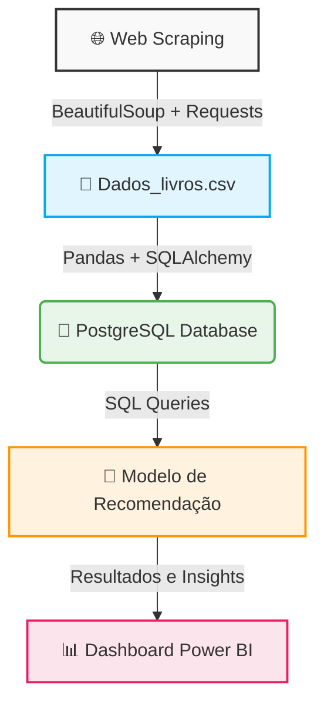

# 📚 End-to-End Data Engineering & Data Science: Sistema de Recomendação de Livros


## 📖 Sobre o Projeto
Este projeto é uma solução analítica ponta a ponta (End-to-End) que explora os domínios de **Engenharia de Dados** e **Ciência de Dados**. O mercado atual exige cada vez mais que Cientistas de Dados possuam autonomia para ingerir, tratar e disponibilizar dados através de técnicas de Engenharia de Dados. 

O projeto simula um cenário real onde realizamos a coleta de dados de um e-commerce de livros (*Books to Scrape*), armazenamos essas informações em um banco de dados relacional e, em seguida, construímos um modelo de recomendação que sugere livros aos usuários baseando-se em suas preferências. Por fim, os dados e recomendações são disponibilizados de forma interativa através de um dashboard no Power BI.

## 🏗️ Arquitetura do Projeto

Abaixo é demonstrado o fluxo de dados desde a origem até o consumo final pelo usuário:



## 🛠️ Tecnologias e Ferramentas Utilizadas
* **Linguagem:** Python
* **Coleta de Dados (Web Scraping):** `requests`, `BeautifulSoup`
* **Manipulação e Análise de Dados:** `pandas`, `numpy`
* **Banco de Dados:** PostgreSQL, `psycopg2`, `SQLAlchemy`
* **Machine Learning & NLP:** `scikit-learn` (Cosine Similarity, TF-IDFVectorizer), `scipy`
* **Visualização de Dados:** `matplotlib`, `seaborn`, **Power BI**

## 📂 Estrutura do Repositório
* `WebScreping.py`: Script responsável por acessar o site, paginar sobre o catálogo de livros e extrair informações como Título, Preço, Nota, Estoque, Categoria e Descrição. Salva o resultado em `Dados_livros.csv`.
* `Import_data.sql`: Script DDL para criar a tabela `Books_Data` no banco de dados PostgreSQL.
* `Importa_dados.py`: Script para leitura do arquivo CSV e carga (Load) direta no banco de dados PostgreSQL utilizando SQLAlchemy.
* `Executor.bat`: Arquivo em lote executável (Batch script) que orquestra a execução da extração (WebScreping.py) e carga (Importa_dados.py) de forma sequencial.
* `Modelo_recomendacao.ipynb`: Jupyter Notebook contendo a Análise Exploratória de Dados (EDA) e o desenvolvimento do Sistema de Recomendação baseado em conteúdo (Content-Based Filtering).
* `Dashboard de Recomendação.pbix`: Arquivo do painel interativo no Power BI para consumo dos dados e visualização das recomendações.

## 🚀 Como Executar o Projeto

### 1. Pré-requisitos
* Ter o Python 3.8+ instalado.
* Ter o PostgreSQL instalado e configurado localmente.
* Instalar as dependências do projeto:
  ```bash
  pip install pandas numpy beautifulsoup4 requests sqlalchemy psycopg2 scikit-learn seaborn matplotlib
  ```

### 2. Configuração do Banco de Dados
* Execute o script `Import_data.sql` no seu PostgreSQL para criar a estrutura da tabela.
* No arquivo `Importa_dados.py`, insira as credenciais do seu banco de dados na variável de conexão `str` e/ou `engine`.

### 3. Extração e Carga de Dados (ETL)
* Você pode rodar de forma automatizada pelo prompt de comando utilizando o arquivo batch:
  ```bash
  Executor.bat
  ```
  *(Nota: Verifique os caminhos absolutos do python.exe e dos scripts dentro do arquivo `Executor.bat` para garantir que apontam para os diretórios corretos na sua máquina local).*
* Ou executar os scripts individualmente na ordem:
  1. `python WebScreping.py`
  2. `python Importa_dados.py`

### 4. Modelo de Recomendação
* Abra o arquivo `Modelo_recomendacao.ipynb` no Jupyter Notebook ou VS Code.
* Configure as credenciais de acesso ao seu PostgreSQL na célula de conexão (`psycopg2.connect`).
* Execute todas as células para gerar as análises gráficas e visualizar o funcionamento do sistema de recomendação de livros similares.

## 📊 Visualização de Dados e Dashboard

O resultado final desse pipeline é disponibilizado para o usuário em um Dashboard Dinâmico construído no Power BI. Através dele, é possível consultar o acervo e receber dicas dos melhores livros de acordo com um título de interesse.

🔗 **[Acessar o Web Dashboard do Power BI](https://app.powerbi.com/view?r=eyJrIjoiYjFhMGFiYjAtZDdkNC00MGNhLWFiYzctZTFlZTZjZGJmYjc5IiwidCI6ImMyZjBkMDYxLWE3ZmYtNGExMi1iYTdkLWNiYjEyZTliMTljMCJ9)**